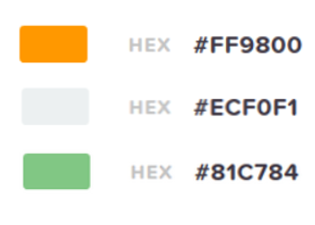
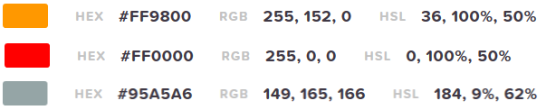
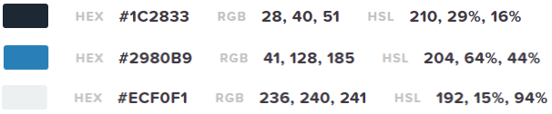
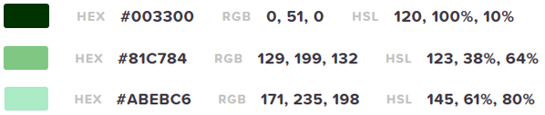

# poc-plateforme-enchere

## Concept de l'application web :
plateforme de mise aux enchères d' un produit proposé par l’administrateur du site. Un utilisateur inscrit, s’il le désire, peut indiquer son souhait d’achat et il sera facturé selon les paramètres indiqués par l’administrateur du site. Les utilisateurs ont un temps imparti pour participer à l’enchère et chaque renchérissement ajoute X délai déterminé par l’administrateur pour participer à l’enchère. Passé ce délai, le produit est remporté par le dernier utilisateur à avoir surenchéri.

## User Stories 
| Role                      | Quoi?                                                     | Pourquoi?                                         |
| :------------------------ | :-------------------------------------------------------- | :------------------------------------------------ |
| En tant qu’administrateur | Ajouter un nouveau produit à mettre aux enchères          | Mettre sur la plateforme                          |
| En tant qu’administrateur | Paramétrer le produit à mettre aux enchères               | Afficher la photo et la designation du produit    |
| En tant qu’administrateur | Paramétrer les conditions de lancement de l’enchère       | Donner le prix de départ et la durée initiale     |
| En tant qu’administrateur | Paramétrer les conditions de l’enchère                    | Coût du clic, durée ajoutée au clic, prix du clic |
| En tant qu’utilisateur    | Consulter les produits en ligne                           | Voir l’évolution de des enchères                  |
| En tant qu’utilisateur    | Connaître le temps restant de l’enchère                   | Savoir quand celle-ci prend fin                   |
| En tant qu’utilisateur    | Pouvoir naviguer de façon simple sur le site              | Comprendre rapidement le fonctionnement           |
| En tant qu’utilisateur    | Que le site soit disponible sous plusieurs format d’écran | Consulter sur tout type de support                |
| En tant qu’utilisateur    | Savoir comment fonctionne les enchères (règles)           | Comprendre le fonctionnement des enchères         |

## Wireframe
### Wireframe-desktop

### Wireframe-mobile

## Palettes de couleurs

### Validation

### Proposition 1

* Orange :
  * Plus agressif, l’orange est parfait pour les « call to action » et provoque l’envie d’acheter ou de s’abonner. 
  * Fanta, qui vise un public jeune dans son marketing, propose un orange vif qui capte l’attention d’un public très demandé et provoque un sentiment de confiance lors de l’achat.

* Rouge (Urgence, pousser à l'acte d'achat et de clic) :
  * L’excitation. Le rouge est associé à l’urgence, lors des soldes et promotions, c’est principalement le rouge qui est utilisé. 
  * Il représente également la jeunesse et l’énergie, deux points sur lesquels Coca-Cola s’appuie énormément.

* Gris (Connaissance et Neutralité) :
  * Parité entre client et prestataire
  * L’innovation est très représentée par la couleur grise. Loin d’être fade, elle détermine souvent la connaissance et la neutralité. 
  * Apple utilise son logo gris depuis des années et fait souvent figure de grand innovateur.

### Proposition 2

* Blanc :
  * Assimilé à la pureté, à la paix et qu'il est le symbole de la sagesse, l'innocence, la pureté et le Divin.

* Bleu nuit : 
  * Plonge le regard. 
  * Pousse à l’introspection. 
  * Sérénité, apaisement, sagesse, loyauté. 
  * Capte l’attention.
  * Garder le client le plus longtemps possible sur le site et faire en sorte qu’il se sente seul à réfléchir à ses actes. Mêlé au bleu plus clair qui rappelle au sérieux et à l’aspect de droiture d’entreprise. 

### Proposition 3

* Noir :
  * Associé à un fond du site en blanc le noir va apporter une touche Feng Shui
  * Suscite la puissance
  * Audace, formalité, luxe, mystère, force
  * Sony, Disney, Nike...

* Vert : 
  * Tres utilisée pour promouvoir des produits
  * Stimulant de concentration
  * Attire l'attention (exemple le feu vert d'un feu de circulation et donne le GO)
  * Couleur de l'espoir, méditation, inspiration

